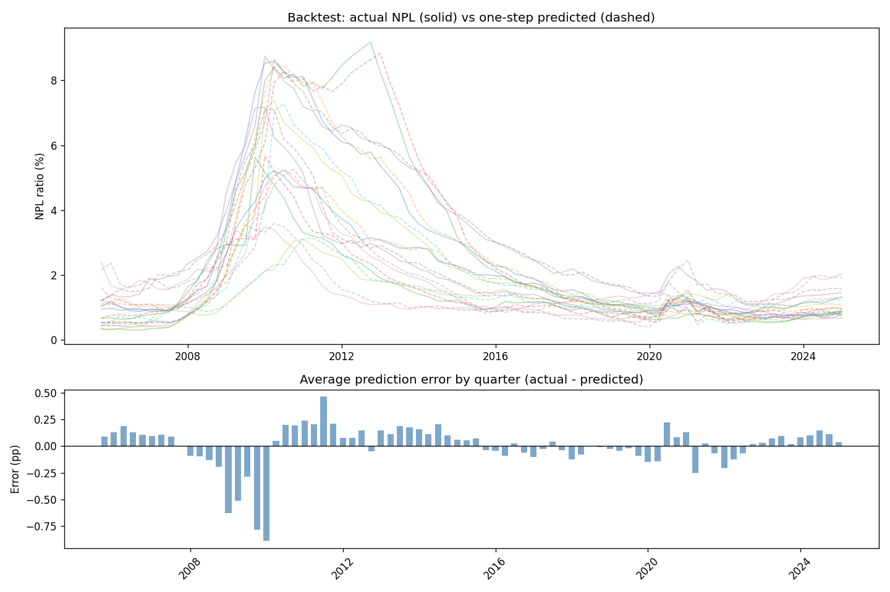
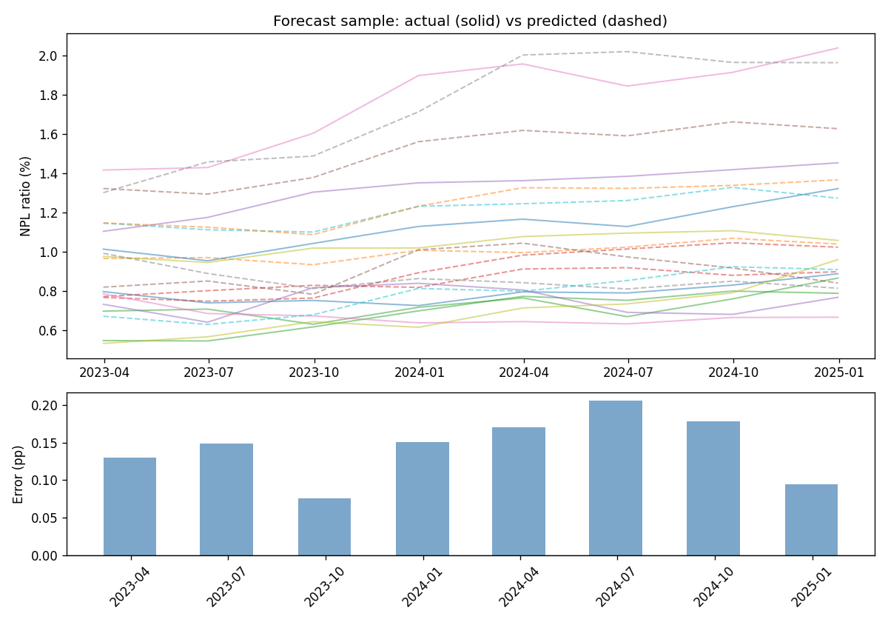
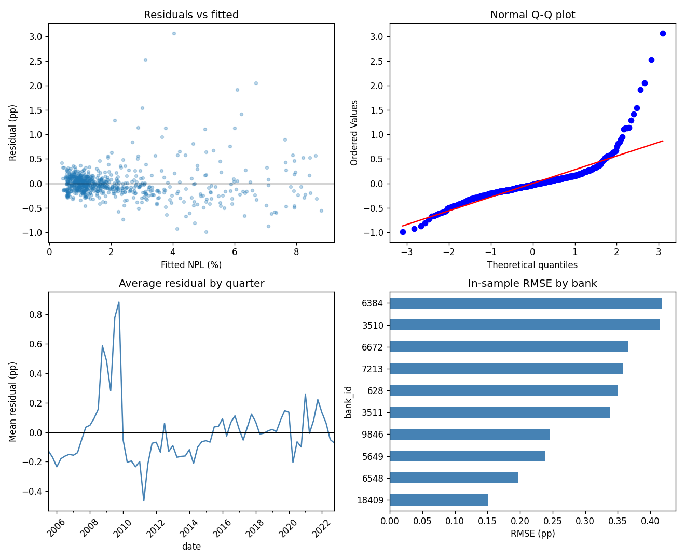
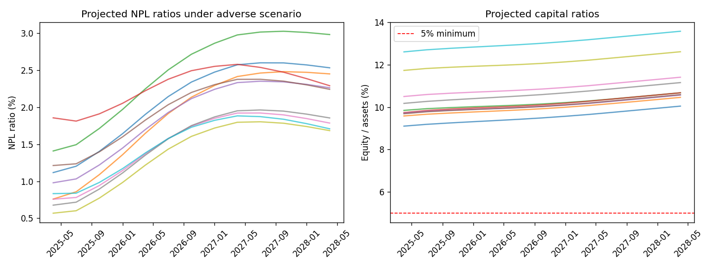

# US Bank Credit Stress Test

A Python implementation of a macro stress test on public US bank data. The project estimates how nonperforming loan (NPL) ratios move with the economy, checks that the model holds up out of sample, and translates a Federal Reserve adverse scenario into projected credit losses and capital ratios for ten large US banks.

---

## How banks actually stress credit risk (and what this project does instead)

If you walk into a large bank's risk team and ask how they stress credit, you will usually hear about **probability of default (PD)**, **loss given default (LGD)**, and **exposure at default (EAD)**. Under IFRS 9, expected credit loss (ECL) is built from those three ingredients, often at the loan or facility level, with ratings migration and stage allocation (Stage 1, 2, 3) driving provisions on the balance sheet. In CCAR and DFAST, banks go further: loan-level or segment-level models for commercial real estate, cards, mortgages, and C&I, sometimes with detailed collateral and prepayment dynamics, all shocked under a supervisory macro scenario.

That bottom-up stack is the real production system. It requires loan tapes, internal ratings, write-off histories, and models that are validated, documented, and challenged every cycle.

This repository is **not** that. It is a **top-down satellite model** of the kind supervisors and central banks often use when they need to link a macro scenario to bank-level credit outcomes without full loan-level data. Instead of PD x LGD x EAD at the instrument level, the model uses the **NPL ratio** directly as a function of lagged NPL and a small set of macro variables (GDP growth, unemployment, mortgage rates). Losses are then backed out with a fixed LGD assumption. The capital module is deliberately simple: equity rolls forward from pre-provision income minus credit losses, with no risk-weighted assets, no AFS marks, and no management actions.

All inputs are public (FDIC call reports, FRED, Fed scenario CSVs). The code is short enough to read in an afternoon. The workflow follows standard macro stress testing practice: define a scenario, estimate a macro-to-risk satellite model, validate it, then project balance-sheet outcomes. The simplification is in the data and the loss engine, not in the logic.

---

## The workflow in plain language

The exercise runs in four steps.

1. **Build a panel.** Pull quarterly financials for ten US banks from the FDIC and merge them with macro history from FRED.
2. **Estimate a satellite model.** Regress each bank's NPL ratio on its own lag, GDP growth, unemployment, and mortgage rates, with a fixed effect for each bank.
3. **Validate the model.** Backtest in sample, forecast out of sample on 2023-2024, run standard regression diagnostics, and check unit roots.
4. **Run the stress test.** Feed the 2025 Fed severely adverse scenario through the model, convert the resulting NPL paths into losses, and roll capital forward.

Everything is modular. You can inspect the scenario loader, the regression, the validation flags, and the capital formulas separately. That is how stress testing should be structured whether you are at a central bank or reviewing a model as a validator.

---

## Data

### Banks and the credit metric

I use ten large US banks (JPMorgan, Bank of America, Wells Fargo, Citi, U.S. Bank, PNC, Truist, Fifth Third, KeyBank, Regions). Quarterly data come from the [FDIC BankFind API](https://banks.data.fdic.gov/docs/), which is free and does not require an API key. After the first download, results are cached locally so you do not need to hit the API every time.

The dependent variable is the **NPL ratio** from call report fields:

$$\text{NPL ratio (\%)} = \frac{\text{NCLNLS}}{\text{LNLSNET}} \times 100$$

`NCLNLS` is noncurrent loans and leases. `LNLSNET` is net loans and leases. This is a coarse but standard portfolio-level measure of credit quality. A PD-based model would instead track migration from performing to default within each rating grade. Here I observe the **outcome** (NPL stock relative to loans) and relate it to the macro environment.

**Sample of banks in the panel:**

| CERT | Bank |
|---:|---|
| 628 | JPMorgan Chase Bank NA |
| 3510 | Bank of America NA |
| 3511 | Wells Fargo Bank NA |
| 7213 | Citibank NA |
| 6548 | U.S. Bank NA |
| 6384 | PNC Bank NA |
| 9846 | Truist Bank |
| 5649 | Fifth Third Bank NA |
| 6672 | KeyBank NA |
| 18409 | Regions Bank |

### Macro variables

Macro series are bundled in `data/fred_macro_history.csv` so the project runs without a FRED API key. The model uses four regressors in the final specification, but the panel includes a wider set for specification testing.

| Variable | FRED series | Used in final model? |
|---|---|---|
| Real GDP growth | A191RL1Q225SBEA | Yes (lag 2) |
| Unemployment | UNRATE | Yes (contemporaneous) |
| 30-year mortgage rate | MORTGAGE30US | Yes (lag 1) |
| 3-month T-bill | TB3MS | No (dropped in final spec) |
| CPI inflation | CPIAUCSL | No |
| House price index | CSUSHPINSA | No |

The panel runs from **2005 Q1 to 2024 Q4** (80 quarters per bank). After attaching two lags, **780 bank-quarters** remain for estimation.

### Stress scenario

For the stress test I apply the **2025 Fed supervisory severely adverse domestic scenario** (`data/2025-Table_3A_Supervisory_Severely_Adverse_Domestic.csv`). Bank history ends at 2024 Q4. The scenario path starts at 2025 Q1 and runs for nine quarters, matching the standard DFAST planning horizon.

---

## The satellite model

### Specification

The final model has four macro terms plus bank fixed effects and a lagged dependent variable:

$$
\text{NPL}_{i,t} = \alpha_i + \rho\,\text{NPL}_{i,t-1} + \beta_1\,\text{GDP}_{t-2} + \beta_2\,\text{UR}_{t} + \beta_3\,\text{Mtg}_{t-1} + \varepsilon_{i,t}
$$

The lagged NPL term captures persistence. Credit quality does not reset every quarter. The GDP term enters with a two-quarter lag, which is consistent with the idea that weaker growth shows up in delinquencies with a delay. Unemployment enters contemporaneously. The mortgage rate enters with one lag, which proxies for pressure on household debt service and housing-related portfolios.

I estimate the equation by pooled OLS with bank dummies and **HC1 robust standard errors**. There are bank fixed effects only, no time fixed effects. Common macro shocks enter through the regressors rather than through time dummies.

### How I got to this specification

I did not start with four variables. The first pass included two lags of GDP, unemployment, and short rates on top of lagged NPL. That fit well in sample but was too rich for ten banks. I dropped variables and lags step by step, checking forecast stability and coefficient signs at each stage. GDP worked better at lag 2 than lag 1. Contemporaneous unemployment beat a lagged term. The mortgage rate added more than the T-bill alone for this sample. HPI, CPI, and the T-bill were dropped from the final spec.

That iterative trimming is normal in satellite model development. The goal is not the highest in-sample R-squared. It is a stable, interpretable mapping from scenario to NPL that a validator can challenge.

### Estimated coefficients (full panel, 780 obs.)

| Variable | Coef. | Std. err. | Sign | Reading |
|---|--:|--:|---|---|
| `npl_lag1` | 0.942 | 0.011 | + | NPL is highly persistent |
| `real_gdp_growth_lag2` | -0.007 | 0.002 | - | Weaker growth raises NPL with delay |
| `unemployment` | 0.052 | 0.010 | + | Higher unemployment raises NPL |
| `mortgage_rate_lag1` | 0.077 | 0.008 | + | Higher rates raise NPL with one-quarter lag |

R-squared is 0.972. All coefficients are significant at the 1% level. The signs match basic credit-cycle intuition: a worse macro path pushes NPL up, and last quarter's NPL is the strongest predictor of this quarter's NPL.

In a PD-based framework these relationships would appear indirectly through migration matrices and segment PDs. Here they are estimated in reduced form on the NPL ratio itself, which is what makes the model a satellite rather than a structural credit engine.

---

## Model validation

Validation matters as much as estimation, especially if you are targeting model risk or stress testing roles. The project includes a `validate_model()` function that produces a structured report with automated PASS, WARN, and FAIL flags. I treat WARN seriously. A flag does not mean the model is broken, but it does mean I would discuss that issue in a validation memo.

### What the validator checks

The function covers economic plausibility (do coefficient signs make sense?), statistical fit, multicollinearity, residual diagnostics, in-sample backtest error, out-of-sample forecast error, and a separate flag for GFC-period fit. Full code is in `stresskit/validation.py`.

```python
from stresskit import SatelliteNPLModel, validate_model

model = SatelliteNPLModel().fit(estimation_panel)
report = validate_model(
    model,
    full_panel,
    est_end="2022-12-31",
    oos_start="2023-03-31",
    oos_end="2024-12-31",
)
report.print_summary()
report.save("data/")
```

**Validation summary (estimation through 2022 Q4): 12 PASS, 4 WARN, 0 FAIL.**

| Check | Status | What it means |
|---|---|---|
| Coefficient signs | PASS | All four regressors signed as theory suggests |
| Significance | PASS | All p-values below 1% |
| R-squared | PASS | 0.972 |
| In-sample RMSE | PASS | 0.32 pp |
| Out-of-sample RMSE | PASS | 0.17 pp (about half the in-sample error) |
| Out-of-sample bias | PASS | +0.14 pp, model slightly under-predicts |
| Heteroskedasticity | PASS | Breusch-Pagan rejects, HC1 SEs used |
| Durbin-Watson | WARN | 1.12, some positive autocorrelation |
| Ljung-Box | WARN | Serial correlation in residuals |
| Residual normality | WARN | Fat tails, driven by the GFC |
| Multicollinearity | WARN | Unemployment VIF = 10.7 |
| GFC period RMSE | WARN | 0.75 pp in 2008-2009 vs 0.11 pp in 2015-2019 |

The warnings are honest. A linear AR model with ten banks is not going to fit the GFC well, and unemployment correlates with lagged NPL by construction. In a bank validation I would document these points and test challenger specifications (crisis dummy, shorter estimation window, alternative unemployment transform). I would not hide them.

---

## Does the model track realized NPL?

### In-sample backtest

The first test is simple: at each quarter, can the model predict that quarter's NPL using only information available up to the prior quarter? That is a one-step-ahead backtest across the full panel.

Overall error is **0.31 pp RMSE** and **0.18 pp MAE**, where errors are measured in percentage points of the NPL ratio. On a bank running at a 1% NPL ratio, that is roughly a third of a percentage point of typical prediction error.

**Backtest error by bank:**

| Bank | RMSE (pp) | MAE (pp) |
|---|---:|---:|
| Regions | 0.14 | 0.11 |
| U.S. Bank | 0.19 | 0.13 |
| Fifth Third | 0.23 | 0.18 |
| Truist | 0.24 | 0.16 |
| Wells Fargo | 0.33 | 0.19 |
| JPMorgan Chase | 0.34 | 0.20 |
| Citibank | 0.35 | 0.21 |
| KeyBank | 0.35 | 0.18 |
| Bank of America | 0.40 | 0.26 |
| PNC | 0.40 | 0.18 |

The chart below plots actual NPL (solid) against one-step predicted NPL (dashed) for each bank over time. The top panel shows that the model tracks the level and trend reasonably well in calm periods. The bottom panel plots the average prediction error by quarter. Errors cluster around the Global Financial Crisis, when a linear model without a regime switch cannot capture the speed of deterioration.



**How to read the chart.** Each colored line in the top panel is one bank. Where solid and dashed lines stay close, the model is tracking realized credit quality. Where they diverge, usually 2008-2009 or at banks with idiosyncratic NPL histories (Bank of America after acquisitions, PNC in the GFC), the satellite is missing something structural. The bar chart below shows that those errors are not random noise in one direction. They spike in the crisis and are much smaller in 2015-2019.

**RMSE by sub-period (estimation window):**

| Period | RMSE (pp) |
|---|---:|
| 2005-2007 | 0.20 |
| 2008-2009 | 0.75 |
| 2010-2014 | 0.29 |
| 2015-2019 | 0.11 |
| 2020-2022 | 0.18 |

The GFC row is the one I would spend the most time on in a model review. Everything else is tolerable for a portfolio-level satellite.

### Out-of-sample forecast (2023 Q1 to 2024 Q4)

In-sample fit can always be engineered. A more informative test is whether the model forecasts a period it never saw during estimation. I estimate through **2022 Q4** and forecast **2023 Q1 to 2024 Q4**, which gives 80 bank-quarters (8 quarters times 10 banks).

| Metric | Value |
|---|---:|
| RMSE | 0.17 pp |
| MAE | 0.16 pp |
| Bias | +0.14 pp |

The model **under-predicts** realized NPL by about 0.14 pp on average. NPL ticked up modestly in 2024 and the satellite, anchored on high persistence, lagged that turn slightly.

**Panel average by quarter:**

| Quarter | Actual NPL (%) | Predicted (%) | Error (pp) |
|---|---:|---:|---:|
| 2023 Q1 | 0.86 | 0.99 | +0.13 |
| 2023 Q2 | 0.84 | 0.99 | +0.15 |
| 2023 Q3 | 0.91 | 0.98 | +0.08 |
| 2023 Q4 | 0.96 | 1.11 | +0.15 |
| 2024 Q1 | 1.01 | 1.18 | +0.17 |
| 2024 Q2 | 0.97 | 1.18 | +0.21 |
| 2024 Q3 | 1.02 | 1.20 | +0.18 |
| 2024 Q4 | 1.08 | 1.17 | +0.09 |



**How to read the chart.** The top panel again shows actual (solid) vs predicted (dashed) NPL. In the holdout window the lines track each other more closely than in the GFC, which is why OOS RMSE is lower than full-sample in-sample RMSE. The bottom panel shows quarter-by-quarter bias. Bars above zero mean the model predicted higher NPL than realized early in 2023, then flipped to under-prediction as actual NPL rose in 2024. That pattern is worth noting in a validation report even when overall RMSE looks good.

### Regression diagnostics

The next chart is the standard econometric health check on residuals from the 2022 Q4 estimation window.



**How to read the chart.**

- **Top left (residuals vs fitted):** Residuals should scatter randomly around zero. A funnel shape would suggest heteroskedasticity. Breusch-Pagan rejects homoskedasticity, which is why I use HC1 robust standard errors.
- **Top right (Q-Q plot):** The tails deviate from the diagonal, especially in the upper tail. That is the GFC fat tail showing up in the residual distribution. Jarque-Bera rejects normality.
- **Bottom left (average residual by quarter):** Systematic positive or negative errors in particular periods. The GFC stands out again.
- **Bottom right (RMSE by bank):** Bank of America and PNC have the largest in-sample errors, consistent with the backtest table.

**Variance inflation factors:**

| Variable | VIF |
|---|---:|
| `npl_lag1` | 3.9 |
| `real_gdp_growth_lag2` | 1.1 |
| `unemployment` | 10.7 |
| `mortgage_rate_lag1` | 6.4 |

Unemployment VIF above 10 reflects correlation between unemployment and lagged NPL. I would monitor coefficient stability across rolling windows before relying on that point estimate in a live stress test.

### Unit root tests

Before relying on NPL in levels, I checked stationarity with Phillips-Perron and Zivot-Andrews tests (using the `arch` package). Bank NPL ratios do not reject a unit root in levels for most institutions. GDP growth is stationary. Unemployment is borderline.

That supports including the AR term. First-differencing NPL would remove the level information that stress testers care about. Supervisors want to know the projected **level** of NPL under an adverse path, not just the change.

---

## Stress test results

Once the model is estimated on history, I feed the **2025 Fed severely adverse scenario** through it starting from each bank's 2024 Q4 position. The satellite produces a nine-quarter NPL path. The capital module then converts NPL increases into credit losses and rolls equity forward.

The loss translation is intentionally simple compared to an ECL engine:

```
new NPLs (dollars)  = max(change in NPL ratio, 0) x net loans
credit loss         = new NPLs x LGD (45%)
net income          = PPNR - credit loss
equity              = equity + net income
capital ratio       = equity / total assets
```

PPNR is modeled as a flat quarterly ROA (0.10% under stress vs 0.30% in the baseline default). There are no dividends, no capital raises, and no risk-weighted capital ratio.

**Capital and loss results under the severely adverse scenario:**

| Bank | Trough capital (%) | End capital (%) | Total credit loss | Breach 5% floor? |
|---|---:|---:|---:|---|
| JPMorgan Chase | 9.10 | 10.04 | $10.3B | No |
| Bank of America | 9.58 | 10.46 | $8.4B | No |
| U.S. Bank | 9.68 | 10.59 | $2.0B | No |
| PNC | 9.71 | 10.56 | $1.9B | No |
| Fifth Third | 9.74 | 10.67 | $0.4B | No |
| Wells Fargo | 9.84 | 10.67 | $6.3B | No |
| Citibank | 10.17 | 11.15 | $3.7B | No |
| KeyBank | 10.50 | 11.41 | $0.6B | No |
| Truist | 11.73 | 12.61 | $1.7B | No |
| Regions | 12.60 | 13.57 | $0.8B | No |



**How to read the chart.** The left panel shows projected NPL ratios under the adverse scenario. NPL roughly doubles over the horizon for most banks, which is the satellite's response to the macro path (rising unemployment, falling GDP, higher rates). The right panel shows the equity-to-assets ratio. Capital ratios **rise** slightly over the projection because PPNR exceeds losses in this simplified module. That is a limitation, not a finding about real bank resilience. A full DFAST-style projection would include RWA growth, balance sheet rebalancing, and often declining PPNR under stress. The red dashed line at 5% is a reference floor. No bank crosses it here, but that outcome follows from the assumptions above rather than from a definitive solvency assessment.

In a real bank, this stage would sit on top of hundreds of PD/LGD models by segment, with provisions flowing through the ECL framework and capital measured against CET1 and leverage ratios. Here the point is to show that the satellite output connects to a balance-sheet narrative, not to replicate CCAR.

---

## What I would improve next

If I were taking this from a class project to a production-style exercise, these would be my priorities:

1. **Replace the NPL satellite with a PD-based segment structure** (even a coarse one: CRE, cards, C&I, residential) if loan-level or segment data were available.
2. **Add risk-weighted capital** instead of equity over total assets.
3. **Model PPNR properly** (NII satellite with repricing gaps, not a flat ROA).
4. **Add a crisis regime** (dummy or threshold) so the GFC is not treated like a normal draw.
5. **Expand the bank sample** or stratify by asset size and business model.

Every simplification above is visible in the code as a named parameter. That is intentional. Stress testing is as much about assumptions as it is about econometrics.

---

## Running the project

Requires Python 3.10+ and the packages in `requirements.txt`. The first run downloads FDIC data over the internet and caches it locally.

```bash
git clone https://github.com/muhammadumarshinwari/us-bank-credit-stress-test.git
cd us-bank-credit-stress-test
pip install -r requirements.txt
python examples/run_all.py
```

That single command runs the stress test, out-of-sample forecast, validation suite, unit root tests, and PDF report. You can also run each stage separately from the `examples/` folder.

Key outputs land in `data/` (CSVs) and `docs/` (charts and `US_Bank_Credit_Stress_Test.pdf`).

---

## Disclaimer

This is an educational project built entirely on public data. It is not supervisory software. The outputs are not assessments of any real bank's credit quality, provisions, or capital adequacy.
